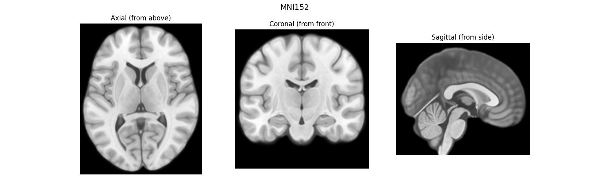
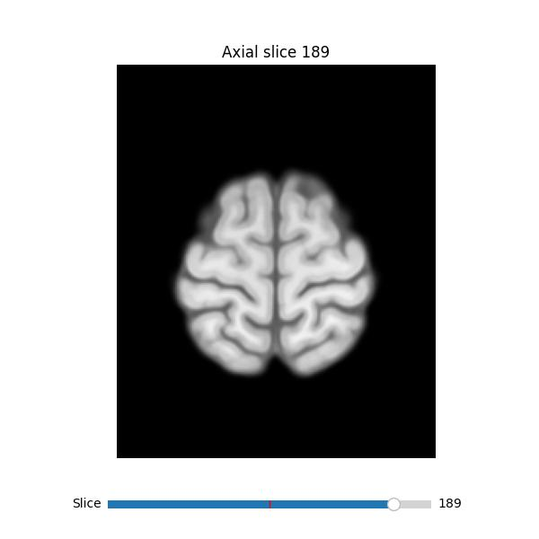

# NIfTI/MNI152

| Dataset | Description | Link |
|---------|----------------------|------|
| Linear ICBM Average Brain (ICBM152) | An average of 152 T1-weighted MRI scans, linearly transformed to Talairach space | [nist.mni.mcgill.ca/icbm-152lin](https://nist.mni.mcgill.ca/icbm-152lin/) |
| mni152.nii.gz | Convenient modern redistribution of the MNI152 template | [niivue demo](https://niivue.github.io/niivue-demo-images/mni152.nii.gz) |
| minimal.nii | A simple ramp image, increasing from 0-63 along the Y axis... provided as an example and test dataset | [NIfTI test data](https://nifti.nimh.nih.gov/nifti-1/data/minimal.nii.gz/file_view.html) |
| avg152T1_RL_nifti.nii | Classic avg152T1 stored in neurological (RAS) convention | [NIfTI test data](https://nifti.nimh.nih.gov/nifti-1/data/avg152T1_RL_nifti.nii.gz/file_view.html) |
| ICBM 2009c Nonlinear Asymmetric | 1x1x1mm template | [NIFTI 57MB](https://www.bic.mni.mcgill.ca/~vfonov/icbm/2009/mni_icbm152_nlin_asym_09c_nifti.zip) |
| ICBM 2009b Nonlinear Asymmetric** | 0.5x0.5x0.5mm template | [NIFTI 358MB](https://www.bic.mni.mcgill.ca/~vfonov/icbm/2009/mni_icbm152_nlin_asym_09b_nifti.zip) |

**Not committed due to filesize

## mni152-axial-coronal-sagittal.py

## mni152-axial-slice-flipbook.py

